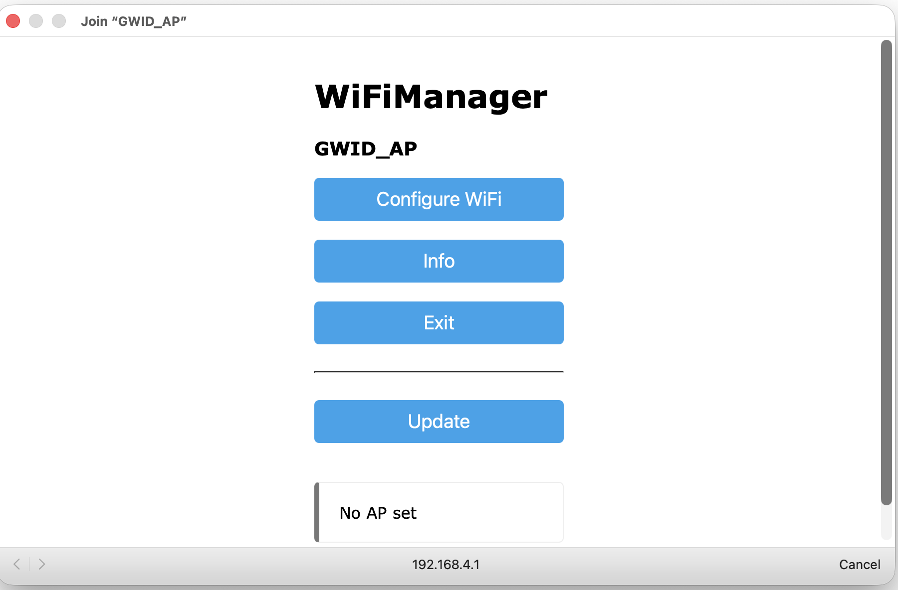

# GWDIC USER GUIDE PART 1:  CONNECT TO WIFI NETWORK

Once the GWID is connected to the network, the user can directly control it
through a browser window on a computer, laptop or cell phone connected to the 
same network. Any home automation hub that can communicate with LAN devices 
using http messages (e.g., Hubitat Elevation), will also be able to use the GWID 
functionality, though this typically requires a custom driver.

## Information Needed

- WiFi Network SSID and password

- GWID's MAC Address

## STEP 1 - Assign a Static IP on the Router DHCP Table

- Log into the WiFi router

- Using **MAC Address** of the GWID device, create an entry in the DHCP
  Table to assign a unique static IP address to the GWID. Make a note
  of this IP address.

## STEP 2 - Configure the GWID WiFi Connection

- Overview: In WiFi configuration mode, GWID creates a local access
  portal named GWID_AP with IP address `192.168.4.1` where the user
  selects from a list of available WiFi networks, provides the
  corresponding password, and provides the static IP address and port of
  the Hubitat hub. Once saved, this information persists in the GWID's
  flash memory across power disruptions, reboots, or network disconnects
  until the device is reset by the user (see below).

- Step-by-step procedure:

  - Connect the GWID to power. If a single red pixel at position 0 is
    lit, the device is in WiFi configuration mode. If the device shows
    anything other than a single red pixel then it is not in WiFi
    configuration mode (in that case, RESET the device to clear any
    previously saved credentials--see below).

  - Bring a laptop or cell phone with WiFi close to GWID, go to the
    network settings page and look for an access portal named
    **GWID_AP** (the IP address is `192.168.4.1`). Connect to the access
    portal. Once connected to the access portal, a configuration menu
    will open in a browser window.
 
    

    - From that configuration menu, click on Configure WiFi, select the
      desired WiFi **SSID** from the list of available networks, and
      enter the corresponding **password**

    - Click the Save button

    - NOTE: That same configuration page has fields for the home automation
      hub's static IP address and Port. Leaving these fields blank (i.e.,
      null values) does not limit the user's ability to control the device
      directly via HTTP. The user can also update these values on the
      device at a later time via HTTP message.

  - Once the user clicks the Save button, the GWID will attempt to connect
    to the WiFi network using the supplied SSID and password. Success of this
    initial connection usually happens within seconds, and is indicated by
    a single green pixel flashing four times on the device.\
    \
    NOTE: If after a minute or so the device continues to display a
    single red pixel or nothing at all, that means that the device has
    not been able to connect to the network with the SSID and password
    that the user specified via the access portal. Manually RESET the
    device (see below) and repeat STEP 2 from the top.

  - After the GWID establishes a successful WiFi connection for the
    first time, it will reboot. The device will now automatically
    reconnect to the configured WiFi network after every reboot until
    the network configuration is RESET by the user.

- GWID indications during normal bootup

  - When the GWID reboots, it will first display a single yellow pixel
    to indicate that is attempting to connect to the network using the
    saved WiFi credentials. This usually takes a couple of seconds.

  - Once the GWID is connected to WiFi it will display a single green
    pixel. 

  - When the GWID is fully initialized and ready to accept commands
    it will display a single blue pixel.
    
- **Once the GWID is connected to WiFi, the user can send commands to
   the device via HTTP from a browser window on computer, laptop or cell
   phone connected to the same network.**  For example, verify the device
   configuration by entering the following in the browser's address field:\
     \
     `http://<GWID_IPAddress>/report`\
     (Replace `<GWID_IPAddress>` with the actual IP address of the device.)

- For easy testing and demonstration, download and open the html file
  ([`gwid-control-panel.html`](/examples/gwid-control-panel.html)) from the ([`examples\`](/examples) folder
  and open that file in a browser window. This generates a user-friendly HTML interface
  for interacting with the GWID.
  
## How to "factory reset" the device to erase WiFi credentials and all saved settings

  - To reset (delete) WiFi credentials from the GWID's flash memory and reboot
    the device into WiFi configuration mode, press and hold the reset button for
    three seconds while the device is connected to power.
 
  - Alternatively, 1) disconnect the GWID from its power source, 2) press and hold
    the reset button, 3) reconnect the device to power, then 4) release the reset button.

  - A "factory reset" will also erase saved IP and Port values and IP restrictions
    from the device

## TROUBLESHOOTING

- From a computer, laptop or cell phone connected to the same network,
  use `http://<GWID_IPAddress>report` to verify GWID network
  connectivity and IP address

---

&copy; 2025, 2026 Tim Sakulich. GWID documentation is licensed under Creative Commons Attribution-ShareAlike 4.0 International.  
See: [`LICENSE-DOCS`](/LICENSE-DOCS)
