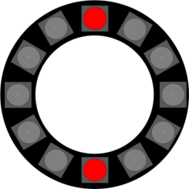
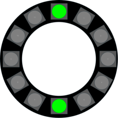
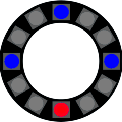

# GWID USER GUIDE PART 2: PIXEL INDICATIONS DURING BOOT UP 

|Pixel Display|Description|
|:----------------------------------:|:----------------------------------------|
||Red pixel @ position 0  GWID is in WiFi Configuration Mode.  The GWID has opened the GWID_AP access portal @ IP Address 192.168.1.4 and is waiting on user to supply network credentials through the portal.|
||Red pixels @ position 0 and 6 (flashing)  GWID is in WiFi Configuration Mode.   The GWID failed to connected to the network using the credentials supplied through the GWID_AP access portal, and will reboot into the Access Portal again. |
||Green pixels @ positions 0 and 6 (flashing)  GWID is in WiFi Configuration Mode.   The GWID successfully connected to the network for the first time, and will reboot for normal operations.|
| | |
||Yellow pixel @ position 0  Part of normal boot up sequence.   The GWID is initializing and attempting to connect to the network.|
||Yellow pixels @ positions 0 and 6 (flashing)  Part of normal boot up sequence.   The GWID failed to connect using the saved network credentials, and will reboot. If this happens repeatedly, the user should manually reset the device, and supply correct network credentials through the configuration mode.  |
||Green pixel @ position 0  Part of normal boot up sequence.   The GWID succefully connected to WiFi.|
||Blue pixel @ position 0  Part of normal boot up sequence.   The GWID is ready to accept commands. If the values of SavedIP and SavedPort are **not** set, the GWID will pause in this state until it receives an external command.|
| | |
|  |Blue pixels @ positions 0 and 6  Part of normal boot up sequence. The GWID is configured with savedIP and savedPort information but the **restricted flag is NOT set**.  /OR/  Blue pixel @ position 0 and Red pixel @ position 6  Part of normal boot up sequence.  The GWID is configured with savedIP and savedPort information and the **restricted flag is set**.|
| | |
|  |Blue pixels @ position 0, 3, 6, and 9 Part of normal boot up sequence.  The GWID has sent a `sync` request to the URL defined by savedIP and savedPort and is awaiting a reply, but the **restricted flag is NOT set**. The GWID will pause in this state until it receives an external command.   /OR/  Blue pixels @ positions 0, 3, and 9 and Red pixel @ postiion 6 Part of normal boot up sequence.  The GWID has sent a `sync` request to the URL defined by savedIP and savedPort and is awaiting a reply, and the **restricted flag is set**. The GWID will pause in this state until it receives an external command **from the savedIP**.|
|Any other pixel colors/patterns|The GWID pixels and the piezo buzzer change in response to properly formatted messages.|

---

&copy; 2025, 2026 Tim Sakulich. GWID documentation is licensed under Creative Commons Attribution-ShareAlike 4.0 International.  
See: [`LICENSE-DOCS`](/LICENSE-DOCS)
