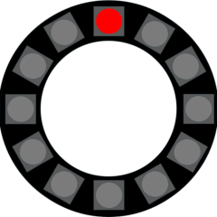
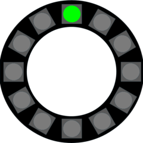
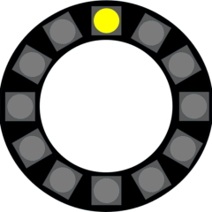
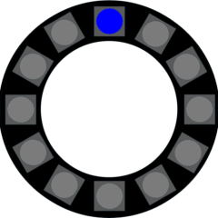
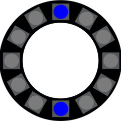
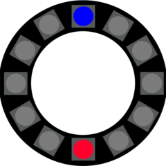
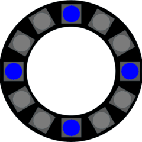
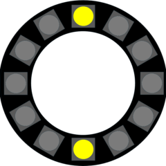

# GWID USER GUIDE PART 2: PIXEL INDICATIONS DURING BOOT UP 

|Pixel Display|Description|
|:----------------------------------:|:----------------------------------------|
||Red pixel @ position 0   GWID is in WiFi Configuration Mode. It has opened the GWID_AP access portal and is waiting on user to supply network credentials through the portal.|
||Green pixel (flashing) @ position 0   GWID is in WiFi Configuration Mode. It has successfully connected to the network, and is about to reboot. |
||Yellow pixel @ position 0   Part of normal boot up sequence. The GWID is initializing and attempting to connect to the network.   Connection may take a few seconds, but if the device appears to “hang” at this stage, unplug the GWID and then power it back up. If it still fails to connect, press the GWID reset button and re-enter WiFi credentials through the access portal). NOTE: The GWID's NodeMCU radio can have issues if it's physically too close to the router.|
||Green pixel @ position 0   Part of normal boot up sequence. GWID has connected WiFi.|
||Blue pixel @ position 0   Part of normal boot up sequence. The GWID is ready to accept commands. If the values of SavedIP and SavedPort are **not** set, the GWID will pause in this state until it receives an external command.|
||Blue pixel @ positions 0 and 6   Part of normal boot up sequence, and indicating that the GWID is configured with savedIP and savedPort information (restricted flag is NOT set). The GWID will then send a `sync` request to the URL defined by savedIP and savedPort.|
||Blue pixel @ position 0 and Red pixel @ position 6   Part of normal boot up sequence, and indicating that the GWID is configured with savedIP and savedPort information (restricted flag is set). The GWID will then send a `sync` request to the URL defined by savedIP and savedPort.|
||Blue pixels @ positions 0, 3, 6, and 9   Part of normal boot up sequence. The GWID has sent a `sync` message to the URL defined by the savedIP address and savedPort, and is awaiting a reply.|
||Yellow pixels @ positions 0 and 6   GWID has disconnected from the network. It will attempt to reconnect with previously saved credentials.  This can take less than a second or up to a few seconds.|
|Any other pixel colors/patterns|The GWID pixels and the piezo buzzer change in response to properly formatted messages from the Hubitat and from browser HTTP calls|

---

&copy; 2025, 2026 Tim Sakulich. GWID documentation is licensed under Creative Commons Attribution-ShareAlike 4.0 International.  
See: [`LICENSE-DOCS`](/LICENSE-DOCS)
