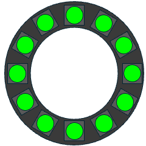
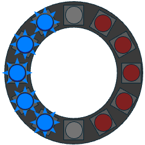
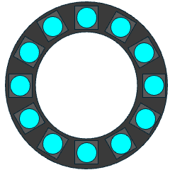
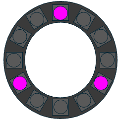
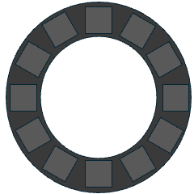
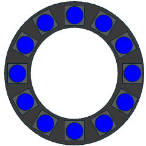
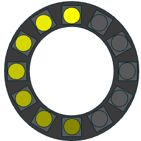

# GWID USER GUIDE PART 4: ANIMATIONS OF EXAMPLE DISPLAY MODES

These are animated examples (.gif format) of the pixel display in various modes as well as links to videos of these modes on an actual physical device. Direct video of the GWID tended to get washed out by the intensity of the pixels and contrast with the surrounding area, so the .gif animations are actually better as examples of the various device modes.  

|Example|Image|Video|
|:---|:---:|:---:|
|`flash` mode in Green  `http://<GWID-IPAddress>/?flash&rgb=00ff00`||[mp4 Video](video/flash-video-green.mp4)|
|`police` mode `http://<GWID-IPAddress>/?police`|||
|`pulse` mode in Cyan `http://<GWID-IPAddress>/?pulse&rgb=00ffff` ||[mp4 Video](video/pulse-video-cyan.mp4) |
|`rotor` mode in Purple `http://<GWID-IPAddress>/?rotor&rgb=ff00ff`||[mp4 Video](video/rotor-video-purple.mp4) |
|`sos` mode in Red `http://<GWID-IPAddress>/?sos&rgb=ff0000` ||[mp4 Video](video/sos-video-red.mp4) |
|`strobe` mode in Blue  `http://<GWID-IPAddress>/?strobe&rgb=0000ff`|| [mp4 Video](video/strobe-video-blue.mp4)|
|`trail` mode in Yellow `http://<GWID-IPAddress>/?trail&rgb=ffff00`||[mp4 Video](video/trail-video-yellow.mp4) |

---

&copy; 2025, 2026 Tim Sakulich. GWID documentation is licensed under Creative Commons Attribution-ShareAlike 4.0 International.  
See: [`LICENSE-DOCS`](/LICENSE-DOCS)

