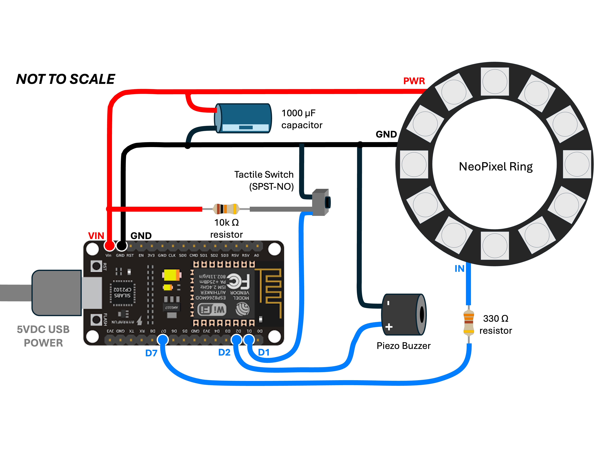

# GWID HARDWARE BUILD

## Components and Connections

|Component|Notes|
|:---|:---|
|NodeMCU 1.0 |ESP8266-based Development Board built around ESP-12E module|
|Power Supply|Connect standard 5V/2A USB power via NodeMCU micro USB port /or/  use a standalone 5V/2A power supply connected to VIN and GND pins of the NodeMCU |
|NeoPixel Ring (12 pixel)  plus a 330 ohm resistor  and 1000 µF capacitor|Connect NeoPixel Ring PWR to VIN on the NodeMCU board Connect NeoPixel Ring GND to GND on the NodeMCU board Connect NeoPixel Ring IN to D7 (GPIO13) on the NodeMCU board via 330 ohm resistor Connect 1000uF Capacitor across GND and PWR |
|Mini Active Piezo Buzzer (3v)|Connect Piezo's positive lead to D2 (GPIO4) on the NodeMCU board Connect the Peizo's negative lead to GND|
|Tactile Switch (SPST-NO) and a 10k ohm resistor|This normally open (NO) single pole single throw (SPST) button switch serves as a manual RESET button.  Connect one of the switch leads to the D1 pin on the NodeMCU board Connect the other switch lead to GND on the NodeMCU board Connect D1 pin on the NodeMCU board to VIN via 10k ohm resister|
|Project Box (if desired for aesthetics)|The entire hardware build can fit inside an ABS Plastic Project Box measuring 80 x 50 x 26 mm (3.15 x 1.97 x 1.02 inches).   - Drill a 1-3/8 inch round hole in the face of the box and mount the NeoPixel ring from the inside of the box with the pixels facing outward.   - Drill a small rectangular opening at one end of the box so that a USB power cable can be connected to the micro USB port on the NodeMCU board.   - Mount the micro button switch to the inside of the box and drill a small hole in the box so that the button can be pushed by inserting the end of paperclip through the hole.|

## Wiring Diagram

## Breadboard Example

## Firmware

Once the hardware build is complete, upload the latest GWID software release via the USB serial port on the NodeMCU board (see [`src/README.md`](src/README.md)). 

Though the initial software upload must be done via NodeMCU serial port, the GWID does have an Over-the-Air (OTA) update capability. Once the GWID is connected to a WiFi network, new software releases can be uploaded over WiFi using the Arduino IDE.

 

## GWID in the Project Box
The electronics will fit into a small ABS plastic project box measuring 80 x 50 x 26 mm (3.15 x 1.97 x 1.02 inches). It's a tight fit, but it is doable. Of course using a larger project box would be easier and more forgiving to work with. Connect the components with 22 gauge wire and solder. Make sure the wires are long enough to provide flexibility to easily manipulate the components into the box but not so long that they start adding unnecessary bulk. Use shrink tubing or electrical tape to cover any exposed joints/leads.

- Mounting the NeoPixel ring: It's best to solder all three connecting wires to the NeoPixel ring before mounting it. Also, cut a piece of thin black vinyl (or thick black paper) into a circle slightly larger than the center opening of NeoPixel ring, and hot glue that to the backside of the ring in order to cover that opening. Next, drill a 1-3/8 inch round hole in the center of the face of the project box. Dry-fit the NeoPixel ring to the hole so that the circuit board is on the inside surface of the box with the pixels facing outward through the hole. One positioned, place several evenly spaced dots of hot glue around the perimeter of the circuit board to attach it to the inside surface of the box.

- Mounting the NodeMCU: With the NodeMCU board positioned inside the project box, note the location of the micro USB port on the board. Use a drill or rotary tool to create a small rectangular opening at one end of the box so that a USB power cable can be connected to the board.

- Mounting the tactile switch: The switch needs to be mounted inside the box in a location where a small hole can be drilled in the project box so that the switch can be depressed by inserting a paperclip or pin through the hole. It's best to solder the two connecting wires to the switch before mounting it. Next, drill the hole. Finally, hot glue the switch into position while taking care not to block the pinhole in the project box or gum up the front (mechanical part) of the switch.

    

---

&copy; 2025, 2026 Tim Sakulich. GWID documentation is licensed under Creative Commons Attribution-ShareAlike 4.0 International.  
See: [`LICENSE-DOCS`](/LICENSE-DOCS)

