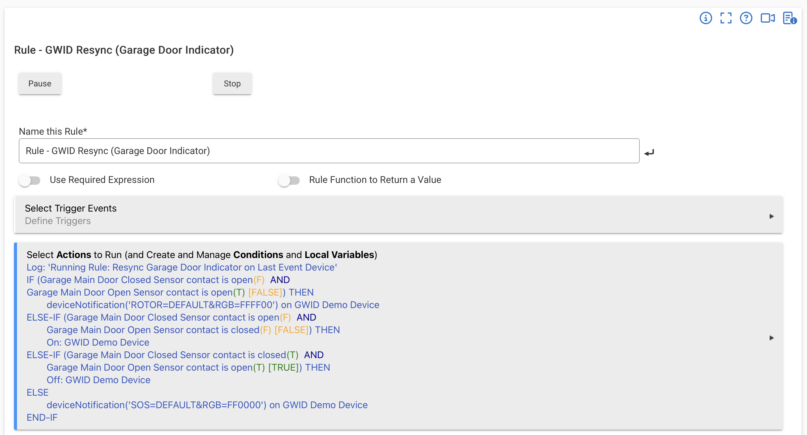
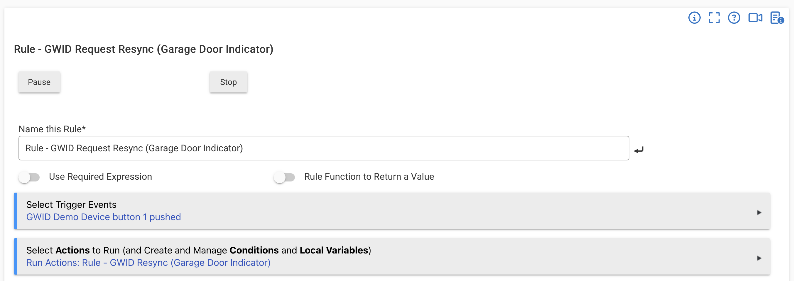

# Example GWID Use Cases with Hubitat
## Use Case 1 - Garage Door Status Indicator
### Concept
Install a normally open Zwave or Zigbee contact switch at the garage door so that the switch is closed when the door is in a fully CLOSED position. When the contact switch notifies the hub of a change (switch opens or closes), use a Hubitat rule to change the GWID display.  E.g., send an “on” command to the GWID when the door opens and an “off” command to the GWDIC when the door closes.
### Advanced Implementation
Use <ins>two</ins> normally open contact switches, CS1 and CS2.  Position CS1 so that it is closed when the garage door is fully CLOSED, and position CS2 so that it is closed when the garage door is fully OPEN.  Then create the following three rules in Hubitat's Rule Machine app.

### Rule 1 - GWID Resync Rule 
This rule simply reads the current states of CS1 and CS2, and uses conditional expressions to determine what command to send to the GWID device. This rule is triggered by other rules.
| CS1 | CS2| Action| 
|:---:|:---:|:---|
|Closed|Open| Send an “off” command to the GWID to indicate that the garage door is fully CLOSED|
|Open|Open| Send the following device notification text string to the GWID.  `rotor&rgb=ffff00&level=40&speed=2&tone=off` This displays a rotating pattern of three evenly-spaced yellow pixels, indicating that the garage door is neither fully open nor fully closed (i.e., moving) 
|Open|Closed| Send an “on” command to the GWID to indicate that the garage door is fully OPEN|
|Closed|Closed| Send the following a device notification text string to the GWID.  `sos&rgb=ff0000&level=40&speed=2&tone=off` This displays a red S.O.S. signal indicating a FAULT.  (The door cannot be fully open and fully closed at the same time...unless the garage door is with Schrödinger’s cat.)|

 
Here's a screenshot of an example of Rule 1 (the GWID device name is "GWID Demo Device"):

 

### Rule 2 - Rule Triggered by Door Movement
Create this rule to trigger whenever there is a change in the state of EITHER contact switch (CS1 or CS2).  When triggered, the only action is to call Rule 1.

The reason to keep Rule 1 separate from Rule 2 is because Hubitat can use Rule 1 to synchronize or resynchronize the GWID in other situations besides actual movement of the door, such as when initilizing the indicator (booting up).

 
Here's a screenshot of an example of Rule 2:

 

### Rule 3 – Rule Triggered by GWID Button 1 Push() Event
Create this rule to trigger when there is a Button 1 push() event from the GWID. When triggered, the only action is to call Rule 1.

The GWID device driver generates a Button 1 push() event whenever the hub receives a `sync` message from the GWID or whenever the user selects the Initialize command from the GWID Commands tab. Rule 3 takes advantage of that event to call Rule 1, which then updates the GWID to indicate the current state of the door.

 
Here's a screenshot of an example of Rule 3 (the GWID device name is "GWID Demo Device"):

  

## Use Case 2 - Water leak alert

### Concept
The GWID can be used as a Strobe, Siren or Both alarm device with Hubitat’s HSM App. The GWID device driver defaults to using red as the strobe color, but the user can change that default to any other valid RGB color on the device Preferences tab.

Another approach is to create a separate rule that triggers whenever a leak is detected, and commands the GWID to strobe blue while beeping. The action in this case is a Device Notification along the lines of 
`strobe&rgb=000022&level=100&speed=2&tone=on`

---

&copy; 2025, 2026 Tim Sakulich. GWID documentation is licensed under Creative Commons Attribution-ShareAlike 4.0 International.  
See: [`LICENSE-DOCS`](/LICENSE-DOCS)

