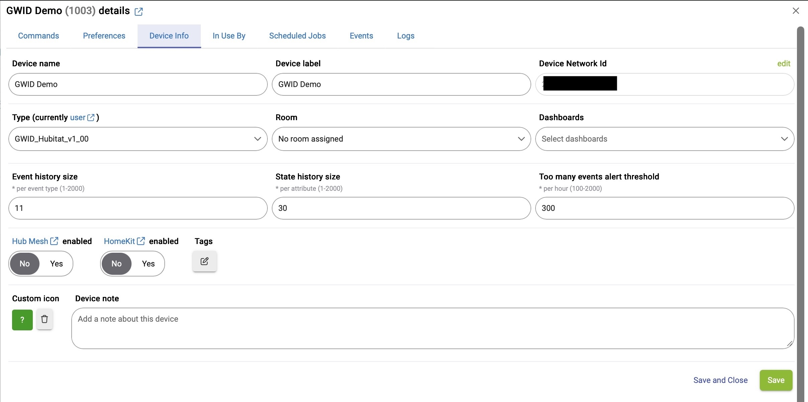
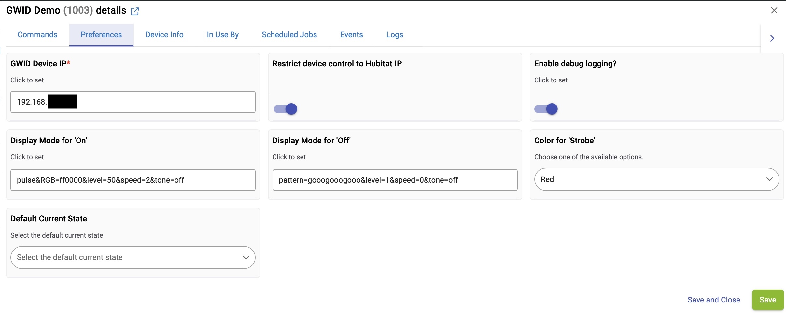
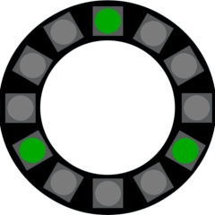
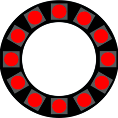
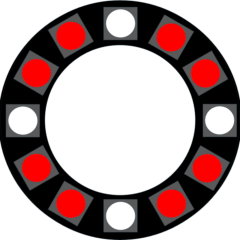
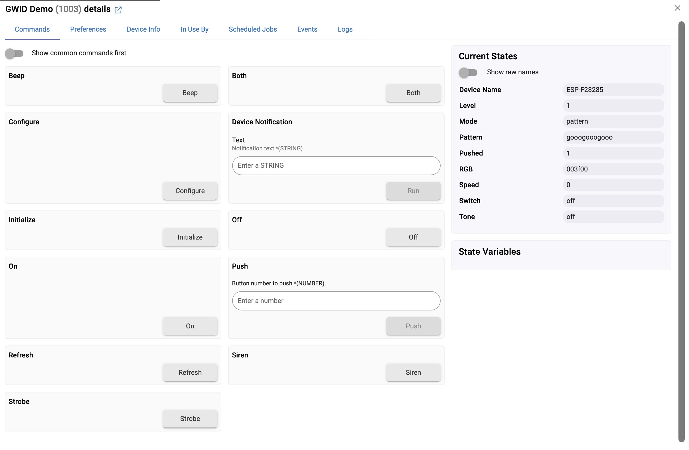
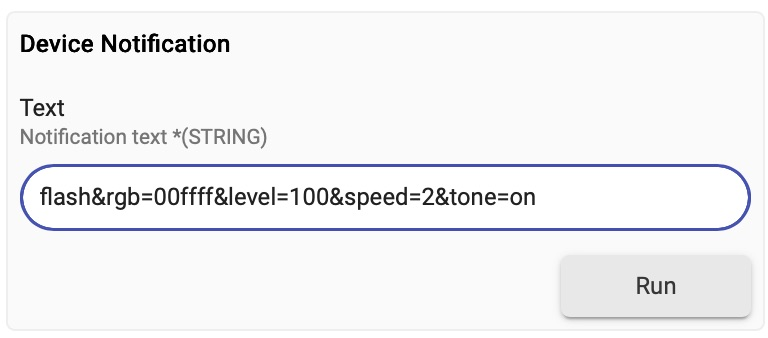

# GWID WITH HUBITAT - USERS GUIDE

## DEVICE INFO
During GWID installation and setup, the user **must** select the correct Type (i.e., GWID driver) and then edit the  Network Id so that it matches the GWID MAC Address (without colons). Otherwise the GWID will not work correctly with the hub. 
 

### SCREENSHOT: GWID DEVICE INFO TAB

 

## DEVICE PREFERENCES

During GWID installation and setup, the user **must** provide the correct GWID Device IP, and then click the Save button. Otherwise the GWID will not work correctly with the hub. 

This screenshot shows all other preferences set to their default values (defined in the device driver).

- Display Mode for 'On' & Display Mode for 'Off' Preferences - The user can change what the GWID does in response to device On and Off commands by changing these preferences. Refer to Part 3 of the GWID Users Guide ([`gwid-user-guide-pt3-http-commands.md`](/docs/gwid-user-guide-pt3-http-commands.md)) in the `docs/` folder for more information on GWID display modes and display mode parameters.

- Color for Strobe - The user can change the color used by the device Strobe command by selecting from the drop-down menu.
  
- Restrict device control to Hubitat IP - When switched to the on position, Hubitat instructs the GWID to reject resource requests that change device settings unless they come from the Hubitat IP address. This restriction persists across GWID reboots. To unrestrict the device, unset the switch. (A "factory reset" of the GWID also clears the IP/Port/restrict settings but clears WiFi settings as well.)

**It is important to click the save button after making any changes to these preferences.**

 

### SCREENSHOT: GWID DEVICE PREFERENCES TAB

### ILLUSTRATIONS OF DEFAULT PREFERENCES FOR ON, OFF, & STROBE COMMANDS

|Pixel Display|Description|
|:---:|:----|
|"Off" command | Defaults to three, evenly-spaced green pixels.   EXPLANATION: In the Preferences tab for the device (see screenshot below), the default value for "Display Mode for 'Off'" is `pattern=gooogooogooo&level=1&tone=off`
|"On" command | Defaults to red pixels (slowly pulsating)  EXPLANATION: In the Preferences tab for the device (see screenshot below), the default value for "Display Mode for 'On'" is `pulse&rgb=ff0000&level=40&speed=2&tone=off`|
|"Strobe" command | Defaults to four flashing white pixels on red background  EXPLANATION: In the Preferences tab for the device (see screenshot below), the default value for "RGB Color for Strobe" is Red. The driver will use the GWID's `strobe` display mode with the selected color.|

 

## DEVICE COMMANDS

The GWID driver includes the following capabilities available through the GWID device Commands tab (see screenshot below) and also available to apps (e.g., rules)

|Command | Description|
|:----|:----|
|Beep| Causes the GWID piezo buzzer to beep one time.|
|Configure|Commands the GWIDC to store the Hubitat IP Address and Port 39501. Hubitat also tells the GWID whether or not to reject commands from any other IP address, based on on the setting **Restrict device control to Hubitat IP** (set through the Preferences tab).   The Hubitat also requests the firmware version information from the GWID, as well as the device's current settings.
|Device Notification |Allows access to the full range of GWID display modes and display mode parameters beyond those that are pre-defined by the device driver.  See [USING THE DEVICE NOTIFICATION CAPABILITY](#USING-THE-DEVICE-NOTIFICATION-CAPABILITY) section below and the GWID Users Guide for more details.|
|Initialize | Forces an update to the GWID display mode and parameters as if the GWID sent a sync request to the hub. The driver creates a button 1 push() event (see "Push" description below).|
|On, Off| Allows the GWID to be treated like a bulb that can be turned on or off by apps and rules.   The display modes and parameters used for these capabilities can be changed on the Preferences page (see illustrations in next section for their default values).|
|Refresh| Updates the device Current State values in Hubitat based on the current settings reported by the GWID. These values are shown on the device’s Commands tab and available to apps and rules. |
|Push |The driver includes this capability simply as a way to trigger rules within Hubitat.    If the GWID has been configured to the Hubitat IP and Port as described above, then when the GWID first boots up it sends a JSON message to the Hubitat containing `sync` as the mode. This tells the driver to create a button 1 push() event. That push() event is seen by Rule Machine and other apps, and is useful to synchronize the GWID based on the current status of other devices (such as a door being open or closed). It is a workaround to writing separate application code. |
|Strobe, Siren, Both| Allows the GWID to be treated like an alarm device that can be triggered by apps and rules.   The base RGB color used for the strobing capability can be changed on the Preferences page (see illustrations in next section for their default values).|

 

### SCREENSHOT: GWID DEVICE COMMANDS TAB

 

## USING THE DEVICE NOTIFICATION CAPABILITY

The Device Notification capability is a way to directly access the full range of GWID display modes and display mode parameters from the device Commands tab and from within Hubitat applications and rules. This enables a great deal of flexibility for the user to customize use cases for the device, without requiring edits to the device driver itself. See the document named [`gwid-hubitat-use-cases.md`](hubitat-gwid-use-cases.md) in this folder for examples.

Refer to Part 3 of the GWID Users Guide ([`gwid-user-guide-pt3-http-commands.md`](/docs/gwid-user-guide-pt3-http-commands.md)) in the `docs/` folder for the full list of display modes and display mode modifiers.

>[!NOTE]
>When using Hubitat device Notificaton capability, DO NOT include the IP Address of the device or the question mark symbol as part of the Notification text string. The device's IP address is already configured in the Preferences tab during initial setup of the device on Hubitat, and the driver automatically adds the question mark symbol to the front of the Notification text string before transmitting that to the GWID.

For example, to set the device mode to `flash`, RGB color to `00ffff`, brightness level to 100 (max), speed to 2 (medium), and activate the piezo buzzer, the user would submit the following as the Device Notification text string via the device Commands tab or as an action in a rule.  `flash&rgb=00ffff&level=100&speed=2&tone=on` 

And here's a screenshot of entering this text string from the device commands tab:

>[!NOTE]
>Device Notification capability in this driver is intended for setting display modes and display mode parameters. It does not support other resource requests to the GWID (i.e., /beep, /getstatus, /getversion, /report, or /saveurl).

---

&copy; 2025, 2026 Tim Sakulich. GWID documentation is licensed under Creative Commons Attribution-ShareAlike 4.0 International.  
See: [`LICENSE-DOCS`](/LICENSE-DOCS)
